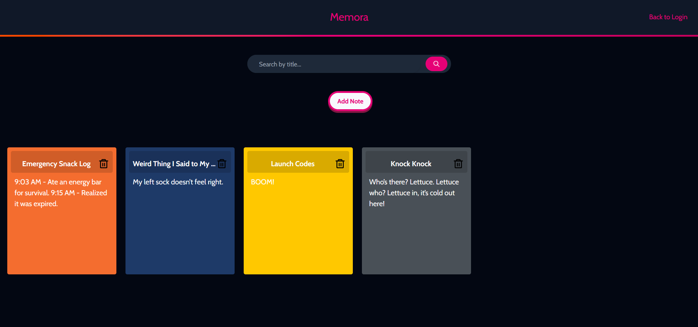

# Memora

Memora is a fully responsive encrypted note taking webapp focused on user privacy which completely lets you have control over your notes!
 

## Dependencies

- [Node.js](https://nodejs.org/en)
- [MongoDB](https://www.mongodb.com)
- [MongoDB Shell](https://www.mongodb.com/docs/mongodb-shell/)

## Usage

Clone the project into your local system [www.github.com/Sooraj-wq/Memora](https://www.github.com/Sooraj-wq/Memora)
 
Create a .env file inside the **backend** directory like the .env.example
Then follow these steps:

Open Terminal/CMD inside the project folder and run:
* `npm install` & `npm install express`
* run `npm run dev`
* Open another terminal and start the MongoDB instance using the command `mongosh`
* Open another terminal and run `cd backend` & `node server.js`

## Technologies Used

* [React](https://react.dev/)
* [Tailwind](https://tailwindcss.com/)
* [Vite](https://vite.dev/)
* [Node.js](https://nodejs.org/en)
* [Express.js](https://expressjs.com/)
* [MongoDB](https://www.mongodb.com)

## Contribution

Memora is still in development, so expect bugs!

Contributions are welcome!

- Fork this repo
- Make your changes in a new branch
- Open a Pull Request

Feel free to open issues for bugs or feature requests :)

## License
This project is licensed under the GNU General Public License v3.0 - see the LICENSE.md file for details.

